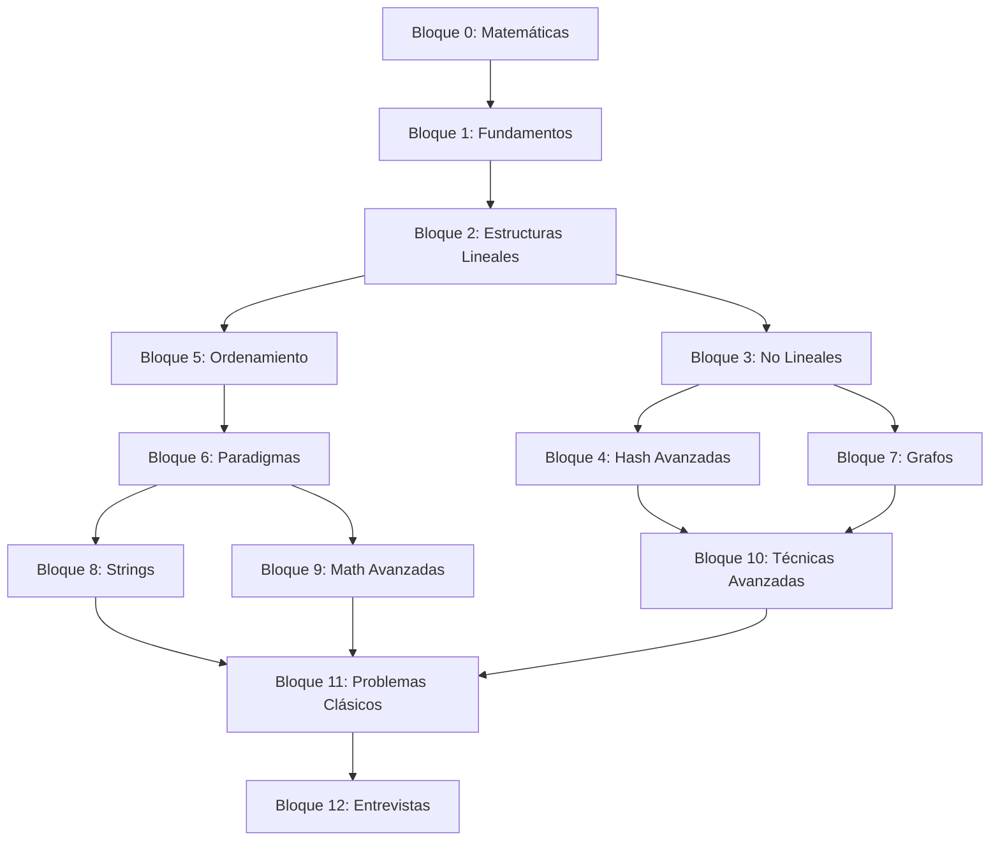
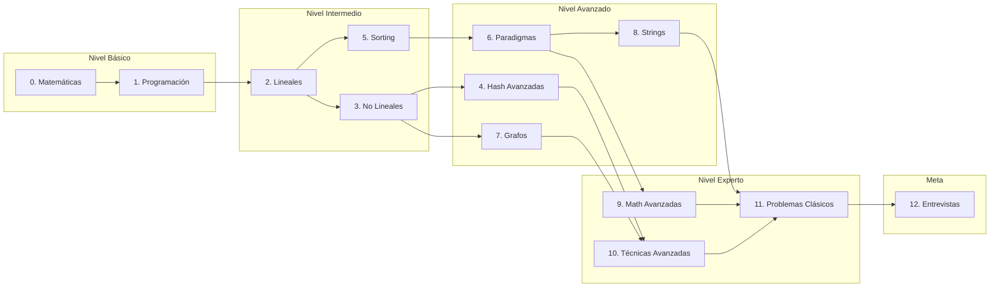

# 🚀 Data Structures & Algorithms - Mega Roadmap

> **Guía completa e incremental** para dominar estructuras de datos y algoritmos, desde los fundamentos matemáticos hasta técnicas avanzadas de programación competitiva y preparación para entrevistas FAANG.

---

## 📋 Tabla de Contenidos

1. [🎯 Cómo usar este Roadmap](#-cómo-usar-este-roadmap)
2. [🔢 Bloque 0: Fundamentos Matemáticos](#-bloque-0-fundamentos-matemáticos)
3. [💻 Bloque 1: Fundamentos de Programación](#-bloque-1-fundamentos-de-programación)
4. [📏 Bloque 2: Estructuras de Datos Lineales](#-bloque-2-estructuras-de-datos-lineales)
5. [🌳 Bloque 3: Estructuras de Datos No Lineales](#-bloque-3-estructuras-de-datos-no-lineales)
6. [🔐 Bloque 4: Hash y Estructuras Avanzadas](#-bloque-4-hash-y-estructuras-avanzadas)
7. [🔄 Bloque 5: Ordenamiento y Búsqueda](#-bloque-5-ordenamiento-y-búsqueda)
8. [🧠 Bloque 6: Paradigmas de Algoritmos](#-bloque-6-paradigmas-de-algoritmos)
9. [🕸️ Bloque 7: Algoritmos de Grafos](#️-bloque-7-algoritmos-de-grafos)
10. [📝 Bloque 8: Algoritmos de Strings](#-bloque-8-algoritmos-de-strings)
11. [📐 Bloque 9: Matemáticas Avanzadas](#-bloque-9-matemáticas-avanzadas)
12. [⚡ Bloque 10: Técnicas Avanzadas](#-bloque-10-técnicas-avanzadas)
13. [🏆 Bloque 11: Problemas Clásicos](#-bloque-11-problemas-clásicos)
14. [💼 Bloque 12: Preparación para Entrevistas](#-bloque-12-preparación-para-entrevistas)

---

## 🎯 Cómo usar este Roadmap

### Leyenda de Progreso
| Símbolo | Significado |
|---------|-------------|
| ⬜ | No iniciado |
| 🟨 | En progreso |
| ✅ | Completado |
| 🔒 | Bloqueado (requiere prerequisitos) |

### Niveles de Dificultad
| Nivel | Descripción |
|-------|-------------|
| 🟢 Básico | Conceptos fundamentales, ideal para principiantes |
| 🟡 Intermedio | Requiere conocimientos previos sólidos |
| 🔴 Avanzado | Técnicas complejas para competencias/entrevistas |
| ⚫ Experto | Nivel de competencias internacionales (ICPC, IOI) |

### Flujo Recomendado

---

## 🔢 Bloque 0: Fundamentos Matemáticos

> **Prerrequisitos:** Ninguno  
> **Nivel:** 🟢 Básico  
> **Temas:** 15  
> **Descripción:** Base matemática esencial antes de abordar algoritmos. Estos conceptos aparecerán constantemente en el análisis y diseño de algoritmos.

| # | Tema | Descripción | Estado |
|---|------|-------------|--------|
| 01 | [Aritmética Básica](./Roadmap/00-Fundamentos-Matematicos/01-Aritmetica-Basica/) | Operaciones, divisibilidad, resto, propiedades | ✅ |
| 02 | [Álgebra](./Roadmap/00-Fundamentos-Matematicos/02-Algebra/) | Ecuaciones, inecuaciones, polinomios | ⬜ |
| 03 | [Teoría de Números](./Roadmap/00-Fundamentos-Matematicos/03-Teoria-de-Numeros/) | Primos, factorización, divisores | ⬜ |
| 04 | [Combinatoria](./Roadmap/00-Fundamentos-Matematicos/04-Combinatoria/) | Permutaciones, combinaciones, principio de conteo | ⬜ |
| 05 | [Probabilidad Básica](./Roadmap/00-Fundamentos-Matematicos/05-Probabilidad-Basica/) | Eventos, probabilidad condicional, valor esperado | ⬜ |
| 06 | [Logaritmos y Exponentes](./Roadmap/00-Fundamentos-Matematicos/06-Logaritmos-Exponentes/) | Propiedades, cambio de base, aplicaciones | ⬜ |
| 07 | [Sucesiones y Series](./Roadmap/00-Fundamentos-Matematicos/07-Sucesiones-Series/) | Aritméticas, geométricas, sumatorias | ⬜ |
| 08 | [Lógica Matemática](./Roadmap/00-Fundamentos-Matematicos/08-Logica-Matematica/) | Proposiciones, tablas de verdad, cuantificadores | ⬜ |
| 09 | [Matrices y Determinantes](./Roadmap/00-Fundamentos-Matematicos/09-Matrices-Determinantes/) | Operaciones matriciales, inversa, aplicaciones | ⬜ |
| 10 | [Inducción Matemática](./Roadmap/00-Fundamentos-Matematicos/10-Induccion-Matematica/) | Pruebas inductivas, correctitud de algoritmos | ⬜ |
| 11 | [Funciones y Notación](./Roadmap/00-Fundamentos-Matematicos/11-Funciones-Notacion/) | Floor, ceil, mod, notación asintótica | ⬜ |
| 12 | [Teoría de Conjuntos](./Roadmap/00-Fundamentos-Matematicos/12-Teoria-de-Conjuntos/) | Operaciones, cardinalidad, conjuntos infinitos | ⬜ |
| 13 | [Grafos y Relaciones](./Roadmap/00-Fundamentos-Matematicos/13-Grafos-y-Relaciones/) | Relaciones de equivalencia, orden parcial, clausuras | ⬜ |
| 14 | [Números Fibonacci y Propiedades](./Roadmap/00-Fundamentos-Matematicos/14-Numeros-Fibonacci-Propiedades/) | Identidades, propiedades, Zeckendorf representation | ⬜ |
| 15 | [Pigeonhole Principle](./Roadmap/00-Fundamentos-Matematicos/15-Pigeonhole-Principle/) | Principio del palomar, aplicaciones en problemas | ⬜ |

---

## 💻 Bloque 1: Fundamentos de Programación

> **Prerrequisitos:** Bloque 0  
> **Nivel:** 🟢 Básico  
> **Temas:** 15  
> **Descripción:** Conceptos esenciales de programación que son la base para implementar cualquier estructura de datos o algoritmo.

| # | Tema | Descripción | Estado |
|---|------|-------------|--------|
| 01 | [Variables y Tipos de Datos](./Roadmap/01-Fundamentos-Programacion/01-Variables-Tipos-Datos/) | Primitivos, referencias, tipado, memoria | ⬜ |
| 02 | [Operadores](./Roadmap/01-Fundamentos-Programacion/02-Operadores/) | Aritméticos, lógicos, bitwise, precedencia | ⬜ |
| 03 | [Estructuras de Control](./Roadmap/01-Fundamentos-Programacion/03-Estructuras-Control/) | If/else, loops, switch, control de flujo | ⬜ |
| 04 | [Funciones](./Roadmap/01-Fundamentos-Programacion/04-Funciones/) | Parámetros, retorno, scope, closures | ⬜ |
| 05 | [Recursión Básica](./Roadmap/01-Fundamentos-Programacion/05-Recursion-Basica/) | Caso base, llamadas recursivas, stack | ⬜ |
| 06 | [Análisis de Complejidad (Intro)](./Roadmap/01-Fundamentos-Programacion/06-Analisis-Complejidad-Intro/) | Big-O, Big-Θ, Big-Ω, análisis básico | ⬜ |
| 07 | [Manejo de Memoria](./Roadmap/01-Fundamentos-Programacion/07-Manejo-de-Memoria/) | Stack vs heap, referencias, garbage collection | ⬜ |
| 08 | [Iteradores y Generadores](./Roadmap/01-Fundamentos-Programacion/08-Iteradores-Generadores/) | Lazy evaluation, memory efficiency, yield | ⬜ |
| 09 | [Manejo de Errores](./Roadmap/01-Fundamentos-Programacion/09-Manejo-de-Errores/) | Try/catch, excepciones, defensive programming | ⬜ |
| 10 | [Input/Output Eficiente](./Roadmap/01-Fundamentos-Programacion/10-Input-Output-Eficiente/) | Fast I/O para competencias, buffers | ⬜ |
| 11 | [Debugging y Testing Básico](./Roadmap/01-Fundamentos-Programacion/11-Debugging-Testing-Basico/) | Unit tests, assertions, print debugging | ⬜ |
| 12 | [Recursión vs Iteración](./Roadmap/01-Fundamentos-Programacion/12-Recursion-vs-Iteracion/) | Trade-offs, conversión, tail recursion | ⬜ |
| 13 | [Complejidad Amortizada](./Roadmap/01-Fundamentos-Programacion/13-Complejidad-Amortizada/) | Banker's method, physicist's method | ⬜ |
| 14 | [Pointer Arithmetic](./Roadmap/01-Fundamentos-Programacion/14-Pointer-Arithmetic/) | Para C/C++, fundamental en competencias | ⬜ |
| 15 | [Lambda y Programación Funcional](./Roadmap/01-Fundamentos-Programacion/15-Lambda-Programacion-Funcional/) | Funciones de orden superior, map/filter/reduce | ⬜ |

---

## 📏 Bloque 2: Estructuras de Datos Lineales

> **Prerrequisitos:** Bloque 1  
> **Nivel:** 🟢 Básico → 🟡 Intermedio  
> **Temas:** 10  
> **Descripción:** Las estructuras de datos fundamentales donde los elementos están organizados de forma secuencial.

| # | Tema | Descripción | Estado |
|---|------|-------------|--------|
| 01 | [Arrays](./Roadmap/02-Estructuras-Lineales/01-Arrays/) | Arreglos estáticos y dinámicos, operaciones O(1) y O(n) | ⬜ |
| 02 | [Strings](./Roadmap/02-Estructuras-Lineales/02-Strings/) | Manipulación, inmutabilidad, operaciones comunes | ⬜ |
| 03 | [Linked Lists](./Roadmap/02-Estructuras-Lineales/03-Linked-Lists/) | Simple, doble, circular, operaciones | ⬜ |
| 04 | [Stacks](./Roadmap/02-Estructuras-Lineales/04-Stacks/) | LIFO, implementación, aplicaciones | ⬜ |
| 05 | [Queues](./Roadmap/02-Estructuras-Lineales/05-Queues/) | FIFO, circular queue, priority queue intro | ⬜ |
| 06 | [Deques](./Roadmap/02-Estructuras-Lineales/06-Deques/) | Double-ended queue, operaciones en ambos extremos | ⬜ |
| 07 | [Matrices 2D y Multidimensionales](./Roadmap/02-Estructuras-Lineales/07-Matrices-2D-Multidimensionales/) | Grids, image processing, DP tables, rotación | ⬜ |
| 08 | [Circular Buffers](./Roadmap/02-Estructuras-Lineales/08-Circular-Buffers/) | Ring buffers, sistemas embebidos, streaming | ⬜ |
| 09 | [Monotonic Stack/Queue](./Roadmap/02-Estructuras-Lineales/09-Monotonic-Stack-Queue/) | Next greater element, sliding window maximum | ⬜ |
| 10 | [Sparse Arrays](./Roadmap/02-Estructuras-Lineales/10-Sparse-Arrays/) | Optimización de memoria, matrices dispersas | ⬜ |

---

## 🌳 Bloque 3: Estructuras de Datos No Lineales

> **Prerrequisitos:** Bloque 2  
> **Nivel:** 🟡 Intermedio → 🔴 Avanzado  
> **Temas:** 16  
> **Descripción:** Estructuras jerárquicas y de red que permiten representar relaciones complejas entre datos.

| # | Tema | Descripción | Estado |
|---|------|-------------|--------|
| 01 | [Trees (Introducción)](./Roadmap/03-Estructuras-No-Lineales/01-Trees-Intro/) | Terminología, propiedades, recorridos básicos | ⬜ |
| 02 | [Binary Trees](./Roadmap/03-Estructuras-No-Lineales/02-Binary-Trees/) | Inorder, preorder, postorder, level order | ⬜ |
| 03 | [Binary Search Trees](./Roadmap/03-Estructuras-No-Lineales/03-Binary-Search-Trees/) | Inserción, búsqueda, eliminación, balanceo | ⬜ |
| 04 | [AVL Trees](./Roadmap/03-Estructuras-No-Lineales/04-AVL-Trees/) | Rotaciones, factor de balance, operaciones O(log n) | ⬜ |
| 05 | [Red-Black Trees](./Roadmap/03-Estructuras-No-Lineales/05-Red-Black-Trees/) | Propiedades, rotaciones, coloreo | ⬜ |
| 06 | [B-Trees](./Roadmap/03-Estructuras-No-Lineales/06-B-Trees/) | Árboles para almacenamiento, bases de datos | ⬜ |
| 07 | [Heaps](./Roadmap/03-Estructuras-No-Lineales/07-Heaps/) | Min/Max heap, heapify, priority queues | ⬜ |
| 08 | [Tries](./Roadmap/03-Estructuras-No-Lineales/08-Tries/) | Prefix trees, autocompletado, diccionarios | ⬜ |
| 09 | [Graphs (Introducción)](./Roadmap/03-Estructuras-No-Lineales/09-Graphs-Intro/) | Dirigidos, no dirigidos, ponderados, terminología | ⬜ |
| 10 | [Representaciones de Grafos](./Roadmap/03-Estructuras-No-Lineales/10-Graphs-Representaciones/) | Matriz adyacencia, lista adyacencia, edge list | ⬜ |
| 11 | [Splay Trees](./Roadmap/03-Estructuras-No-Lineales/11-Splay-Trees/) | Self-adjusting, amortized O(log n), splaying | ⬜ |
| 12 | [Treaps](./Roadmap/03-Estructuras-No-Lineales/12-Treaps/) | Randomized BST, split/merge, implicit treaps | ⬜ |
| 13 | [K-D Trees](./Roadmap/03-Estructuras-No-Lineales/13-KD-Trees/) | Búsqueda espacial multidimensional, nearest neighbor | ⬜ |
| 14 | [Interval Trees](./Roadmap/03-Estructuras-No-Lineales/14-Interval-Trees/) | Overlapping intervals, range stabbing queries | ⬜ |
| 15 | [Order Statistics Trees](./Roadmap/03-Estructuras-No-Lineales/15-Order-Statistics-Trees/) | K-th smallest element O(log n), rank queries | ⬜ |
| 16 | [Grafos Implícitos](./Roadmap/03-Estructuras-No-Lineales/16-Grafos-Implicitos/) | Grafos generados on-the-fly, puzzles, estados | ⬜ |

---

## 🔐 Bloque 4: Hash y Estructuras Avanzadas

> **Prerrequisitos:** Bloque 3  
> **Nivel:** 🟡 Intermedio → 🔴 Avanzado  
> **Temas:** 14  
> **Descripción:** Estructuras de datos especializadas para problemas específicos y optimización de consultas.

| # | Tema | Descripción | Estado |
|---|------|-------------|--------|
| 01 | [Hash Tables](./Roadmap/04-Hash-Estructuras-Avanzadas/01-Hash-Tables/) | Dictionaries, sets, O(1) average | ⬜ |
| 02 | [Hash Functions](./Roadmap/04-Hash-Estructuras-Avanzadas/02-Hash-Functions/) | Diseño, distribución, avalanche effect | ⬜ |
| 03 | [Collision Resolution](./Roadmap/04-Hash-Estructuras-Avanzadas/03-Collision-Resolution/) | Chaining, open addressing, double hashing | ⬜ |
| 04 | [Bloom Filters](./Roadmap/04-Hash-Estructuras-Avanzadas/04-Bloom-Filters/) | Probabilistic data structure, false positives | ⬜ |
| 05 | [Disjoint Set (Union-Find)](./Roadmap/04-Hash-Estructuras-Avanzadas/05-Disjoint-Set-Union-Find/) | Union by rank, path compression, aplicaciones | ⬜ |
| 06 | [Segment Trees](./Roadmap/04-Hash-Estructuras-Avanzadas/06-Segment-Trees/) | Range queries, lazy propagation, persistent | ⬜ |
| 07 | [Fenwick Trees (BIT)](./Roadmap/04-Hash-Estructuras-Avanzadas/07-Fenwick-Trees-BIT/) | Binary indexed trees, prefix sums, 2D BIT | ⬜ |
| 08 | [Sparse Tables](./Roadmap/04-Hash-Estructuras-Avanzadas/08-Sparse-Tables/) | RMQ, LCA, consultas O(1) | ⬜ |
| 09 | [Skip Lists](./Roadmap/04-Hash-Estructuras-Avanzadas/09-Skip-Lists/) | Probabilistic balanced structure | ⬜ |
| 10 | [Cuckoo Hashing](./Roadmap/04-Hash-Estructuras-Avanzadas/10-Cuckoo-Hashing/) | O(1) worst-case lookup, two hash functions | ⬜ |
| 11 | [Perfect Hashing](./Roadmap/04-Hash-Estructuras-Avanzadas/11-Perfect-Hashing/) | Static sets, no collisions, FKS scheme | ⬜ |
| 12 | [Count-Min Sketch](./Roadmap/04-Hash-Estructuras-Avanzadas/12-Count-Min-Sketch/) | Probabilistic frequency estimation, streaming | ⬜ |
| 13 | [Link-Cut Trees](./Roadmap/04-Hash-Estructuras-Avanzadas/13-Link-Cut-Trees/) | Dynamic tree connectivity, path queries | ⬜ |
| 14 | [Wavelet Trees](./Roadmap/04-Hash-Estructuras-Avanzadas/14-Wavelet-Trees/) | Range queries sobre secuencias, rank/select | ⬜ |

---

## 🔄 Bloque 5: Ordenamiento y Búsqueda

> **Prerrequisitos:** Bloque 2  
> **Nivel:** 🟢 Básico → 🟡 Intermedio  
> **Temas:** 18  
> **Descripción:** Algoritmos fundamentales que todo programador debe dominar. Base para muchos otros algoritmos.

| # | Tema | Descripción | Complejidad | Estado |
|---|------|-------------|-------------|--------|
| 01 | [Linear Search](./Roadmap/05-Ordenamiento-Busqueda/01-Linear-Search/) | Búsqueda secuencial básica | O(n) | ⬜ |
| 02 | [Binary Search](./Roadmap/05-Ordenamiento-Busqueda/02-Binary-Search/) | Divide and conquer, variantes | O(log n) | ⬜ |
| 03 | [Ternary Search](./Roadmap/05-Ordenamiento-Busqueda/03-Ternary-Search/) | Para funciones unimodales | O(log n) | ⬜ |
| 04 | [Bubble Sort](./Roadmap/05-Ordenamiento-Busqueda/04-Bubble-Sort/) | Intercambio adyacente, educativo | O(n²) | ⬜ |
| 05 | [Selection Sort](./Roadmap/05-Ordenamiento-Busqueda/05-Selection-Sort/) | Seleccionar mínimo iterativo | O(n²) | ⬜ |
| 06 | [Insertion Sort](./Roadmap/05-Ordenamiento-Busqueda/06-Insertion-Sort/) | Inserción ordenada, adaptativo | O(n²) | ⬜ |
| 07 | [Merge Sort](./Roadmap/05-Ordenamiento-Busqueda/07-Merge-Sort/) | Divide and conquer, estable | O(n log n) | ⬜ |
| 08 | [Quick Sort](./Roadmap/05-Ordenamiento-Busqueda/08-Quick-Sort/) | Partition, pivot selection | O(n log n) avg | ⬜ |
| 09 | [Heap Sort](./Roadmap/05-Ordenamiento-Busqueda/09-Heap-Sort/) | Usando heap, in-place | O(n log n) | ⬜ |
| 10 | [Counting Sort](./Roadmap/05-Ordenamiento-Busqueda/10-Counting-Sort/) | No comparativo, rango limitado | O(n + k) | ⬜ |
| 11 | [Radix Sort](./Roadmap/05-Ordenamiento-Busqueda/11-Radix-Sort/) | Por dígitos, estable | O(d × n) | ⬜ |
| 12 | [Bucket Sort](./Roadmap/05-Ordenamiento-Busqueda/12-Bucket-Sort/) | Distribución uniforme | O(n + k) | ⬜ |
| 13 | [Interpolation Search](./Roadmap/05-Ordenamiento-Busqueda/13-Interpolation-Search/) | Distribución uniforme | O(log log n) | ⬜ |
| 14 | [Tim Sort](./Roadmap/05-Ordenamiento-Busqueda/14-Tim-Sort/) | Hybrid sort, usado en Python/Java | O(n log n) | ⬜ |
| 15 | [Shell Sort](./Roadmap/05-Ordenamiento-Busqueda/15-Shell-Sort/) | Gap-based insertion sort | O(n^1.5) | ⬜ |
| 16 | [Exponential Search](./Roadmap/05-Ordenamiento-Busqueda/16-Exponential-Search/) | Para listas ilimitadas/unbounded | O(log n) | ⬜ |
| 17 | [Parametric Binary Search](./Roadmap/05-Ordenamiento-Busqueda/17-Parametric-Binary-Search/) | Binary search on answer, optimization | O(log n) | ⬜ |
| 18 | [Quickselect](./Roadmap/05-Ordenamiento-Busqueda/18-Quickselect/) | K-th element sin ordenar todo | O(n) avg | ⬜ |

---

## 🧠 Bloque 6: Paradigmas de Algoritmos

> **Prerrequisitos:** Bloques 3, 5  
> **Nivel:** 🟡 Intermedio → 🔴 Avanzado → ⚫ Experto  
> **Temas:** 18  
> **Descripción:** Las técnicas fundamentales de diseño de algoritmos. Dominar estos paradigmas te permitirá resolver la mayoría de los problemas.

| # | Tema | Descripción | Estado |
|---|------|-------------|--------|
| 01 | [Brute Force](./Roadmap/06-Paradigmas-Algoritmos/01-Brute-Force/) | Fuerza bruta, enumeración completa | ⬜ |
| 02 | [Greedy](./Roadmap/06-Paradigmas-Algoritmos/02-Greedy/) | Decisiones locales óptimas, prueba de correctitud | ⬜ |
| 03 | [Divide and Conquer](./Roadmap/06-Paradigmas-Algoritmos/03-Divide-and-Conquer/) | Dividir, conquistar, combinar | ⬜ |
| 04 | [Dynamic Programming (Intro)](./Roadmap/06-Paradigmas-Algoritmos/04-Dynamic-Programming-Intro/) | Subproblemas, overlapping, optimal substructure | ⬜ |
| 05 | [DP: Memoization](./Roadmap/06-Paradigmas-Algoritmos/05-DP-Memoization/) | Top-down, caché de resultados | ⬜ |
| 06 | [DP: Tabulation](./Roadmap/06-Paradigmas-Algoritmos/06-DP-Tabulation/) | Bottom-up, construcción iterativa | ⬜ |
| 07 | [DP: Patrones Clásicos](./Roadmap/06-Paradigmas-Algoritmos/07-DP-Patrones-Clasicos/) | LCS, LIS, Knapsack, Edit Distance | ⬜ |
| 08 | [Backtracking](./Roadmap/06-Paradigmas-Algoritmos/08-Backtracking/) | Exploración con retroceso, pruning | ⬜ |
| 09 | [Branch and Bound](./Roadmap/06-Paradigmas-Algoritmos/09-Branch-and-Bound/) | Optimización con límites, podado | ⬜ |
| 10 | [Two Pointers & Sliding Window](./Roadmap/06-Paradigmas-Algoritmos/10-Two-Pointers-Sliding-Window/) | Técnicas de optimización O(n) | ⬜ |
| 11 | [DP con Bitmask](./Roadmap/06-Paradigmas-Algoritmos/11-DP-Bitmask/) | Subset DP, TSP, asignación óptima | ⬜ |
| 12 | [DP en Árboles](./Roadmap/06-Paradigmas-Algoritmos/12-DP-en-Arboles/) | Tree DP patterns, rerooting technique | ⬜ |
| 13 | [DP en Dígitos (Digit DP)](./Roadmap/06-Paradigmas-Algoritmos/13-DP-Digitos/) | Contar números con propiedades específicas | ⬜ |
| 14 | [DP con Convex Hull Trick](./Roadmap/06-Paradigmas-Algoritmos/14-DP-Convex-Hull-Trick/) | Optimización de recurrencias lineales | ⬜ |
| 15 | [DP con Divide and Conquer](./Roadmap/06-Paradigmas-Algoritmos/15-DP-Divide-and-Conquer/) | Optimización O(n²) → O(n log n) | ⬜ |
| 16 | [Programación Lineal (Intro)](./Roadmap/06-Paradigmas-Algoritmos/16-Programacion-Lineal-Intro/) | Simplex basics, LP relaxation | ⬜ |
| 17 | [Algoritmos Constructivos](./Roadmap/06-Paradigmas-Algoritmos/17-Algoritmos-Constructivos/) | Construir soluciones paso a paso | ⬜ |
| 18 | [Invariantes y Monovariantes](./Roadmap/06-Paradigmas-Algoritmos/18-Invariantes-Monovariantes/) | Técnicas de prueba y diseño de algoritmos | ⬜ |

---

## 🕸️ Bloque 7: Algoritmos de Grafos

> **Prerrequisitos:** Bloques 3, 4, 6  
> **Nivel:** 🟡 Intermedio → 🔴 Avanzado → ⚫ Experto  
> **Temas:** 22  
> **Descripción:** Algoritmos esenciales para resolver problemas de grafos, desde recorridos básicos hasta flujo máximo.

| # | Tema | Descripción | Estado |
|---|------|-------------|--------|
| 01 | [BFS](./Roadmap/07-Algoritmos-Grafos/01-BFS/) | Breadth-First Search, distancia mínima | ⬜ |
| 02 | [DFS](./Roadmap/07-Algoritmos-Grafos/02-DFS/) | Depth-First Search, componentes, ciclos | ⬜ |
| 03 | [Topological Sort](./Roadmap/07-Algoritmos-Grafos/03-Topological-Sort/) | Ordenamiento en DAGs, Kahn's algorithm | ⬜ |
| 04 | [Dijkstra's Algorithm](./Roadmap/07-Algoritmos-Grafos/04-Shortest-Path-Dijkstra/) | Shortest path, pesos no negativos | ⬜ |
| 05 | [Bellman-Ford](./Roadmap/07-Algoritmos-Grafos/05-Bellman-Ford/) | Shortest path con negativos, ciclos | ⬜ |
| 06 | [Floyd-Warshall](./Roadmap/07-Algoritmos-Grafos/06-Floyd-Warshall/) | All-pairs shortest path, O(V³) | ⬜ |
| 07 | [MST: Prim's Algorithm](./Roadmap/07-Algoritmos-Grafos/07-Minimum-Spanning-Tree-Prim/) | Minimum spanning tree greedy | ⬜ |
| 08 | [MST: Kruskal's Algorithm](./Roadmap/07-Algoritmos-Grafos/08-MST-Kruskal/) | MST con Union-Find | ⬜ |
| 09 | [Strongly Connected Components](./Roadmap/07-Algoritmos-Grafos/09-Strongly-Connected-Components/) | Tarjan, Kosaraju | ⬜ |
| 10 | [Articulation Points & Bridges](./Roadmap/07-Algoritmos-Grafos/10-Articulation-Points-Bridges/) | Puntos críticos, conectividad | ⬜ |
| 11 | [Eulerian & Hamiltonian Paths](./Roadmap/07-Algoritmos-Grafos/11-Eulerian-Hamiltonian-Paths/) | Caminos y ciclos especiales | ⬜ |
| 12 | [Max Flow: Ford-Fulkerson](./Roadmap/07-Algoritmos-Grafos/12-Max-Flow-Ford-Fulkerson/) | Flujo máximo, corte mínimo | ⬜ |
| 13 | [Bipartite Matching](./Roadmap/07-Algoritmos-Grafos/13-Bipartite-Matching/) | Hungarian algorithm, asignación | ⬜ |
| 14 | [A* Algorithm](./Roadmap/07-Algoritmos-Grafos/14-A-Star-Algorithm/) | Búsqueda heurística, pathfinding | ⬜ |
| 15 | [Johnson's Algorithm](./Roadmap/07-Algoritmos-Grafos/15-Johnson-Algorithm/) | All-pairs con negativos, O(V²log V + VE) | ⬜ |
| 16 | [2-SAT](./Roadmap/07-Algoritmos-Grafos/16-2-SAT/) | Boolean satisfiability, implication graph | ⬜ |
| 17 | [LCA (Lowest Common Ancestor)](./Roadmap/07-Algoritmos-Grafos/17-LCA-Lowest-Common-Ancestor/) | Binary lifting, Euler tour, O(log n) queries | ⬜ |
| 18 | [Tree Diameter & Center](./Roadmap/07-Algoritmos-Grafos/18-Tree-Diameter-Center/) | Propiedades fundamentales de árboles | ⬜ |
| 19 | [Cycle Detection](./Roadmap/07-Algoritmos-Grafos/19-Cycle-Detection/) | Floyd's, coloring, directed/undirected | ⬜ |
| 20 | [Minimum Cut](./Roadmap/07-Algoritmos-Grafos/20-Minimum-Cut/) | Stoer-Wagner, global min cut | ⬜ |
| 21 | [Planarity Testing](./Roadmap/07-Algoritmos-Grafos/21-Planarity-Testing/) | Grafos planares, K5, K3,3 | ⬜ |
| 22 | [Graph Coloring](./Roadmap/07-Algoritmos-Grafos/22-Graph-Coloring/) | Chromatic number, greedy coloring | ⬜ |

---

## 📝 Bloque 8: Algoritmos de Strings

> **Prerrequisitos:** Bloques 2, 4, 6  
> **Nivel:** 🟡 Intermedio → 🔴 Avanzado → ⚫ Experto  
> **Temas:** 15  
> **Descripción:** Algoritmos especializados en procesamiento de texto y pattern matching.

| # | Tema | Descripción | Estado |
|---|------|-------------|--------|
| 01 | [Pattern Matching Naive](./Roadmap/08-Algoritmos-Strings/01-Pattern-Matching-Naive/) | Búsqueda de patrón O(nm) | ⬜ |
| 02 | [KMP Algorithm](./Roadmap/08-Algoritmos-Strings/02-KMP-Algorithm/) | Knuth-Morris-Pratt, failure function | ⬜ |
| 03 | [Rabin-Karp](./Roadmap/08-Algoritmos-Strings/03-Rabin-Karp/) | Rolling hash, múltiples patrones | ⬜ |
| 04 | [Z-Algorithm](./Roadmap/08-Algoritmos-Strings/04-Z-Algorithm/) | Z-array, pattern matching lineal | ⬜ |
| 05 | [Suffix Arrays](./Roadmap/08-Algoritmos-Strings/05-Suffix-Arrays/) | Ordenamiento de sufijos, LCP | ⬜ |
| 06 | [Suffix Trees](./Roadmap/08-Algoritmos-Strings/06-Suffix-Trees/) | Ukkonen's algorithm | ⬜ |
| 07 | [Longest Common Subsequence](./Roadmap/08-Algoritmos-Strings/07-Longest-Common-Subsequence/) | DP clásico, diff tools | ⬜ |
| 08 | [Edit Distance](./Roadmap/08-Algoritmos-Strings/08-Edit-Distance/) | Levenshtein, spell checking | ⬜ |
| 09 | [String Hashing](./Roadmap/08-Algoritmos-Strings/09-String-Hashing/) | Polynomial hashing, comparación O(1) | ⬜ |
| 10 | [Aho-Corasick](./Roadmap/08-Algoritmos-Strings/10-Aho-Corasick/) | Multi-pattern matching automaton | ⬜ |
| 11 | [Manacher's Algorithm](./Roadmap/08-Algoritmos-Strings/11-Manachers-Algorithm/) | Longest palindromic substring O(n) | ⬜ |
| 12 | [Booth's Algorithm](./Roadmap/08-Algoritmos-Strings/12-Booths-Algorithm/) | Lexicographically minimal rotation | ⬜ |
| 13 | [Lyndon Factorization](./Roadmap/08-Algoritmos-Strings/13-Lyndon-Factorization/) | Duval's algorithm, Lyndon words | ⬜ |
| 14 | [Suffix Automaton](./Roadmap/08-Algoritmos-Strings/14-Suffix-Automaton/) | Efficient substring operations, DAWG | ⬜ |
| 15 | [Palindromic Tree (Eertree)](./Roadmap/08-Algoritmos-Strings/15-Palindromic-Tree/) | All distinct palindromes | ⬜ |

---

## 📐 Bloque 9: Matemáticas Avanzadas

> **Prerrequisitos:** Bloque 0, 6  
> **Nivel:** 🔴 Avanzado → ⚫ Experto  
> **Temas:** 19  
> **Descripción:** Temas matemáticos avanzados fundamentales para competencias de programación y entrevistas técnicas de alto nivel.

| # | Tema | Descripción | Estado |
|---|------|-------------|--------|
| 01 | [Modular Arithmetic](./Roadmap/09-Matematicas-Avanzadas/01-Modular-Arithmetic/) | Operaciones módulo, propiedades | ⬜ |
| 02 | [GCD, LCM, Euclidean](./Roadmap/09-Matematicas-Avanzadas/02-GCD-LCM-Euclidean/) | Algoritmo de Euclides, extendido | ⬜ |
| 03 | [Prime Numbers & Sieve](./Roadmap/09-Matematicas-Avanzadas/03-Prime-Numbers-Sieve/) | Eratosthenes, segmented sieve | ⬜ |
| 04 | [Prime Factorization](./Roadmap/09-Matematicas-Avanzadas/04-Prime-Factorization/) | Factorización, divisores | ⬜ |
| 05 | [Exponenciación Rápida](./Roadmap/09-Matematicas-Avanzadas/05-Exponenciacion-Rapida/) | Binary exponentiation, mod pow | ⬜ |
| 06 | [Inverso Modular](./Roadmap/09-Matematicas-Avanzadas/06-Inverse-Modular/) | Fermat, Euler, aplicaciones | ⬜ |
| 07 | [Combinatorics Advanced](./Roadmap/09-Matematicas-Avanzadas/07-Combinatorics-Advanced/) | Lucas, Catalan, Stirling numbers | ⬜ |
| 08 | [Matrix Exponentiation](./Roadmap/09-Matematicas-Avanzadas/08-Matrix-Exponentiation/) | Recurrencias lineales, Fibonacci O(log n) | ⬜ |
| 09 | [Game Theory & Nim](./Roadmap/09-Matematicas-Avanzadas/09-Game-Theory-Nim/) | Sprague-Grundy, XOR games | ⬜ |
| 10 | [Probability & Expected Value](./Roadmap/09-Matematicas-Avanzadas/10-Probability-Expected-Value/) | Probabilidad en algoritmos, linearity | ⬜ |
| 11 | [Computational Geometry](./Roadmap/09-Matematicas-Avanzadas/11-Geometry-Computational/) | Convex hull, line intersection, area | ⬜ |
| 12 | [Chinese Remainder Theorem](./Roadmap/09-Matematicas-Avanzadas/12-Chinese-Remainder-Theorem/) | Sistemas de congruencias, reconstrucción | ⬜ |
| 13 | [Euler's Totient Function](./Roadmap/09-Matematicas-Avanzadas/13-Euler-Totient-Function/) | Φ(n), coprimes counting, propiedades | ⬜ |
| 14 | [Mobius Function & Inversion](./Roadmap/09-Matematicas-Avanzadas/14-Mobius-Function-Inversion/) | Inclusion-exclusion avanzado, μ(n) | ⬜ |
| 15 | [FFT (Fast Fourier Transform)](./Roadmap/09-Matematicas-Avanzadas/15-FFT-Fast-Fourier-Transform/) | Polynomial multiplication O(n log n) | ⬜ |
| 16 | [NTT (Number Theoretic Transform)](./Roadmap/09-Matematicas-Avanzadas/16-NTT-Number-Theoretic-Transform/) | FFT modular, primitive roots | ⬜ |
| 17 | [Gaussian Elimination](./Roadmap/09-Matematicas-Avanzadas/17-Gaussian-Elimination/) | Sistemas de ecuaciones, matrix rank | ⬜ |
| 18 | [Linear Recurrences](./Roadmap/09-Matematicas-Avanzadas/18-Linear-Recurrences/) | Berlekamp-Massey, Kitamasa | ⬜ |
| 19 | [Burnside's Lemma](./Roadmap/09-Matematicas-Avanzadas/19-Burnsides-Lemma/) | Counting with symmetry, Polya enumeration | ⬜ |

---

## ⚡ Bloque 10: Técnicas Avanzadas

> **Prerrequisitos:** Bloques 4, 6, 7  
> **Nivel:** 🔴 Avanzado → ⚫ Experto  
> **Temas:** 16  
> **Descripción:** Técnicas de nivel competitivo para problemas complejos y optimización extrema.

| # | Tema | Descripción | Estado |
|---|------|-------------|--------|
| 01 | [Bit Manipulation](./Roadmap/10-Tecnicas-Avanzadas/01-Bit-Manipulation/) | Operaciones bitwise, máscaras, trucos | ⬜ |
| 02 | [Meet in the Middle](./Roadmap/10-Tecnicas-Avanzadas/02-Meet-in-the-Middle/) | Dividir búsqueda exponencial | ⬜ |
| 03 | [Square Root Decomposition](./Roadmap/10-Tecnicas-Avanzadas/03-Square-Root-Decomposition/) | Mo's algorithm, bloques √n | ⬜ |
| 04 | [Heavy-Light Decomposition](./Roadmap/10-Tecnicas-Avanzadas/04-Heavy-Light-Decomposition/) | Path queries en árboles | ⬜ |
| 05 | [Centroid Decomposition](./Roadmap/10-Tecnicas-Avanzadas/05-Centroid-Decomposition/) | Divide and conquer en árboles | ⬜ |
| 06 | [Persistent Data Structures](./Roadmap/10-Tecnicas-Avanzadas/06-Persistent-Data-Structures/) | Versiones inmutables, historical queries | ⬜ |
| 07 | [Randomized Algorithms](./Roadmap/10-Tecnicas-Avanzadas/07-Randomized-Algorithms/) | Monte Carlo, Las Vegas | ⬜ |
| 08 | [Approximation Algorithms](./Roadmap/10-Tecnicas-Avanzadas/08-Approximation-Algorithms/) | NP-hard, factor de aproximación | ⬜ |
| 09 | [Online Algorithms](./Roadmap/10-Tecnicas-Avanzadas/09-Online-Algorithms/) | Competitive ratio, streaming | ⬜ |
| 10 | [Parallel Algorithms (Intro)](./Roadmap/10-Tecnicas-Avanzadas/10-Parallel-Algorithms-Intro/) | PRAM, work-span, MapReduce | ⬜ |
| 11 | [Small-to-Large Merging](./Roadmap/10-Tecnicas-Avanzadas/11-Small-to-Large-Merging/) | DSU on trees, O(n log n) merging | ⬜ |
| 12 | [Euler Tour Technique](./Roadmap/10-Tecnicas-Avanzadas/12-Euler-Tour-Technique/) | Flatten tree to array, subtree queries | ⬜ |
| 13 | [Virtual Trees](./Roadmap/10-Tecnicas-Avanzadas/13-Virtual-Trees/) | Auxiliary trees, Steiner trees in trees | ⬜ |
| 14 | [CDQ Divide and Conquer](./Roadmap/10-Tecnicas-Avanzadas/14-CDQ-Divide-and-Conquer/) | Offline queries optimization, 3D problems | ⬜ |
| 15 | [Li Chao Trees](./Roadmap/10-Tecnicas-Avanzadas/15-Li-Chao-Trees/) | Line container, CHT variant, segment tree | ⬜ |
| 16 | [Alien's Trick (WQS Binary Search)](./Roadmap/10-Tecnicas-Avanzadas/16-Aliens-Trick-WQS/) | Lagrange relaxation, constrained optimization | ⬜ |

---

## 🏆 Bloque 11: Problemas Clásicos

> **Prerrequisitos:** Bloques 6, 7, 8  
> **Nivel:** 🟡 Intermedio → 🔴 Avanzado  
> **Temas:** 18  
> **Descripción:** Problemas famosos categorizados por patrón. Dominar estos patrones te preparará para resolver variantes en entrevistas y competencias.

| # | Tema | Descripción | Estado |
|---|------|-------------|--------|
| 01 | [Two Sum Pattern](./Roadmap/11-Problemas-Clasicos/01-Two-Sum-Pattern/) | Hash map, two pointers variations | ⬜ |
| 02 | [Subset Sum](./Roadmap/11-Problemas-Clasicos/02-Subset-Sum/) | DP, bit manipulation approach | ⬜ |
| 03 | [Knapsack Problems](./Roadmap/11-Problemas-Clasicos/03-Knapsack-Problems/) | 0/1, unbounded, fractional | ⬜ |
| 04 | [Longest Increasing Subsequence](./Roadmap/11-Problemas-Clasicos/04-Longest-Increasing-Subsequence/) | DP O(n²), binary search O(n log n) | ⬜ |
| 05 | [Matrix Chain Multiplication](./Roadmap/11-Problemas-Clasicos/05-Matrix-Chain-Multiplication/) | Optimal parenthesization | ⬜ |
| 06 | [Traveling Salesman Problem](./Roadmap/11-Problemas-Clasicos/06-Traveling-Salesman/) | DP bitmask, aproximaciones | ⬜ |
| 07 | [N-Queens](./Roadmap/11-Problemas-Clasicos/07-N-Queens/) | Backtracking clásico | ⬜ |
| 08 | [Sudoku Solver](./Roadmap/11-Problemas-Clasicos/08-Sudoku-Solver/) | Backtracking con constraints | ⬜ |
| 09 | [Word Break](./Roadmap/11-Problemas-Clasicos/09-Word-Break/) | DP con diccionario | ⬜ |
| 10 | [Interval Scheduling](./Roadmap/11-Problemas-Clasicos/10-Interval-Scheduling/) | Greedy, weighted intervals | ⬜ |
| 11 | [Maximum Subarray (Kadane)](./Roadmap/11-Problemas-Clasicos/11-Maximum-Subarray-Kadane/) | DP más famoso, variantes 2D | ⬜ |
| 12 | [Coin Change Variations](./Roadmap/11-Problemas-Clasicos/12-Coin-Change-Variations/) | Min coins, count ways, unlimited/limited | ⬜ |
| 13 | [Partition Problem](./Roadmap/11-Problemas-Clasicos/13-Partition-Problem/) | Equal sum subsets, balanced partition | ⬜ |
| 14 | [Job Scheduling](./Roadmap/11-Problemas-Clasicos/14-Job-Scheduling/) | Weighted, deadlines, penalties, machines | ⬜ |
| 15 | [Stock Buy/Sell Patterns](./Roadmap/11-Problemas-Clasicos/15-Stock-Buy-Sell-Patterns/) | 1 transaction, k transactions, cooldown | ⬜ |
| 16 | [Parentheses Problems](./Roadmap/11-Problemas-Clasicos/16-Parentheses-Problems/) | Valid, generate, score, longest valid | ⬜ |
| 17 | [Merge Intervals](./Roadmap/11-Problemas-Clasicos/17-Merge-Intervals/) | Overlapping intervals, meeting rooms | ⬜ |
| 18 | [Expression Evaluation](./Roadmap/11-Problemas-Clasicos/18-Expression-Evaluation/) | Shunting-yard, recursion, calculator | ⬜ |

---

## 💼 Bloque 12: Preparación para Entrevistas

> **Prerrequisitos:** Todos los bloques anteriores  
> **Nivel:** 🔴 Avanzado  
> **Temas:** 18  
> **Descripción:** Preparación específica para entrevistas técnicas en empresas FAANG y startups de alto nivel.

| # | Tema | Descripción | Estado |
|---|------|-------------|--------|
| 01 | [System Design Basics](./Roadmap/12-Preparacion-Entrevistas/01-System-Design-Basics/) | Escalabilidad, disponibilidad, CAP theorem | ⬜ |
| 02 | [Object-Oriented Design](./Roadmap/12-Preparacion-Entrevistas/02-Object-Oriented-Design/) | SOLID, patrones de diseño, UML | ⬜ |
| 03 | [API Design](./Roadmap/12-Preparacion-Entrevistas/03-API-Design/) | REST, GraphQL, best practices | ⬜ |
| 04 | [Concurrency Basics](./Roadmap/12-Preparacion-Entrevistas/04-Concurrency-Basics/) | Threads, locks, race conditions | ⬜ |
| 05 | [Database Fundamentals](./Roadmap/12-Preparacion-Entrevistas/05-Database-Fundamentals/) | SQL, NoSQL, indexing, transactions | ⬜ |
| 06 | [Behavioral Interview](./Roadmap/12-Preparacion-Entrevistas/06-Behavioral-Interview/) | STAR method, situaciones comunes | ⬜ |
| 07 | [Mock Interviews](./Roadmap/12-Preparacion-Entrevistas/07-Mock-Interviews/) | Práctica, feedback, timing | ⬜ |
| 08 | [Time & Space Complexity Mastery](./Roadmap/12-Preparacion-Entrevistas/08-Time-Space-Complexity-Mastery/) | Análisis rápido, trade-offs | ⬜ |
| 09 | [Problem Solving Strategies](./Roadmap/12-Preparacion-Entrevistas/09-Problem-Solving-Strategies/) | Clarify, examples, brute force first | ⬜ |
| 10 | [Common Interview Patterns](./Roadmap/12-Preparacion-Entrevistas/10-Common-Interview-Patterns/) | Top 20 patrones más frecuentes | ⬜ |
| 11 | [Distributed Systems Concepts](./Roadmap/12-Preparacion-Entrevistas/11-Distributed-Systems-Concepts/) | Consistency, partition tolerance, consensus | ⬜ |
| 12 | [Caching Strategies](./Roadmap/12-Preparacion-Entrevistas/12-Caching-Strategies/) | LRU, LFU, cache invalidation, Redis | ⬜ |
| 13 | [Rate Limiting](./Roadmap/12-Preparacion-Entrevistas/13-Rate-Limiting/) | Token bucket, sliding window, API throttling | ⬜ |
| 14 | [Load Balancing](./Roadmap/12-Preparacion-Entrevistas/14-Load-Balancing/) | Round robin, consistent hashing, L4/L7 | ⬜ |
| 15 | [Message Queues](./Roadmap/12-Preparacion-Entrevistas/15-Message-Queues/) | Kafka, RabbitMQ, pub/sub, event-driven | ⬜ |
| 16 | [Data Modeling](./Roadmap/12-Preparacion-Entrevistas/16-Data-Modeling/) | Schema design, normalization, denormalization | ⬜ |
| 17 | [Testing & TDD](./Roadmap/12-Preparacion-Entrevistas/17-Testing-TDD/) | Unit, integration, mocking, test-driven | ⬜ |
| 18 | [Code Review Best Practices](./Roadmap/12-Preparacion-Entrevistas/18-Code-Review-Best-Practices/) | Readable, maintainable, clean code | ⬜ |

---

## 📊 Resumen del Roadmap

| Bloque | Nombre | Temas | Nivel |
|--------|--------|-------|-------|
| 0 | Fundamentos Matemáticos | 17 | 🟢 |
| 1 | Fundamentos de Programación | 17 | 🟢 |
| 2 | Estructuras Lineales | 14 | 🟢🟡 |
| 3 | Estructuras No Lineales | 23 | 🟡🔴 |
| 4 | Hash y Estructuras Avanzadas | 18 | 🟡🔴 |
| 5 | Ordenamiento y Búsqueda | 23 | 🟢🟡 |
| 6 | Paradigmas de Algoritmos | 25 | 🟡🔴⚫ |
| 7 | Algoritmos de Grafos | 33 | 🟡🔴⚫ |
| 8 | Algoritmos de Strings | 19 | 🟡🔴⚫ |
| 9 | Matemáticas Avanzadas | 28 | 🔴⚫ |
| 10 | Técnicas Avanzadas | 23 | 🔴⚫ |
| 11 | Problemas Clásicos | 25 | 🟡🔴 |
| 12 | Preparación Entrevistas | 25 | 🔴 |
| **Total** | | **290** | |

---

## 🗺️ Mapa de Dependencias Detallado

---

## 🛠️ Recursos Recomendados

### Plataformas de Práctica
| Plataforma | Enfoque | Nivel |
|------------|---------|-------|
| [LeetCode](https://leetcode.com) | Entrevistas FAANG | 🟡🔴 |
| [Codeforces](https://codeforces.com) | Competencias | 🔴⚫ |
| [AtCoder](https://atcoder.jp) | Competencias | 🔴⚫ |
| [HackerRank](https://hackerrank.com) | Variedad | 🟢🟡 |
| [CodeChef](https://codechef.com) | Competencias | 🟡🔴 |
| [CSES](https://cses.fi) | Problemas clásicos | 🟡🔴 |
| [Project Euler](https://projecteuler.net) | Matemáticas | 🔴 |

### Visualizadores
- 🎨 [VisuAlgo](https://visualgo.net) - Visualización de algoritmos
- 🎨 [Algorithm Visualizer](https://algorithm-visualizer.org)
- 🎨 [Data Structure Visualizations](https://www.cs.usfca.edu/~galles/visualization/)

## 📄 Licencia

Este proyecto está bajo la licencia MIT. Siéntete libre de usar, modificar y distribuir.

---

**¿Te gustó este roadmap? ¡Dale una ⭐ al repositorio!**

*Made with ❤️ for the dev community*

**Total de temas: 290 | Bloques: 13 | De principiante a experto**

